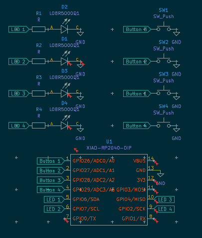
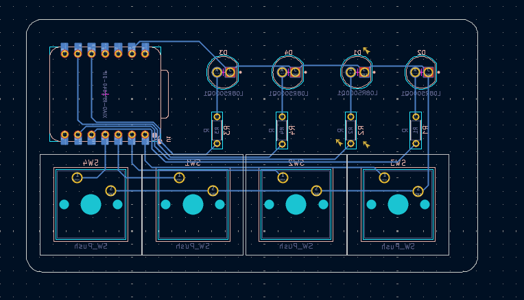
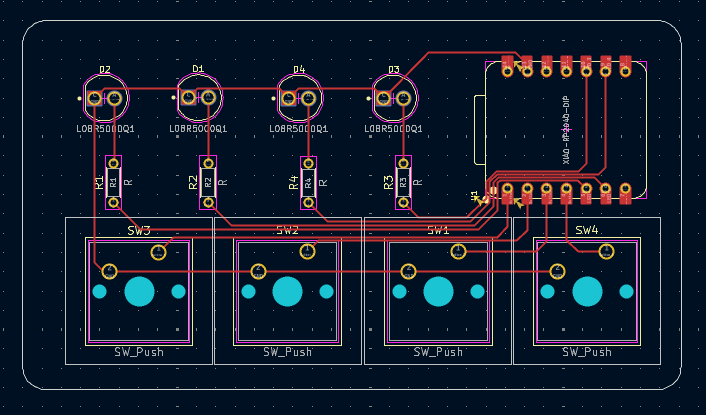

# Mini Memory

This is a small memory game made with 4 LEDs and 4 switches

## How to Play
1. Press all 4 keys for 2 seconds to turn on the game.
2. There are 4 speed levels, click the buttons to configure it (Button 4 = level 4)
3. The game will light up a random LED, you have to press the corresponding button.
4. If you press the wrong button, the game will end.
5. If you press the right button, the game will light up another LED, and you have to press the corresponding button again.
6. The game will continue until you make a mistake.

See script.cpp for the code.

## Schematic and PCB

_Made for [Pathfinder](https://pathfinder.hackclub.com)._